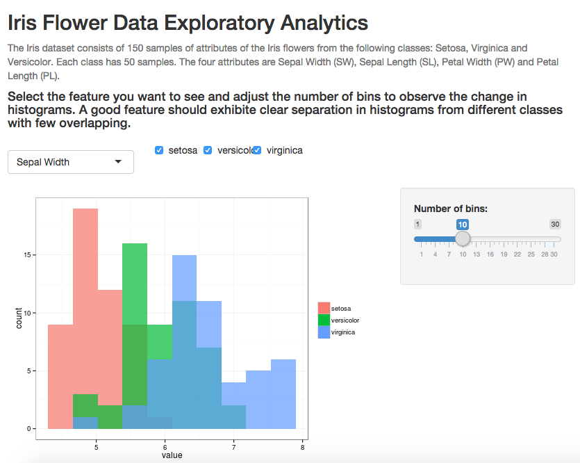

Iris Flower Data Exploratory Analytics
========================================================
author: Jianglei Han
date: 19 August 2015

Dataset
========================================================

The Iris dataset consists of 150 samples of attributes of the Iris flowers from the following classes: 
- Setosa
- Virginica
- Versicolor 

Features
========================================================
Each class has 50 samples. The four attributes are 
- Sepal Width (SW)
- Sepal Length (SL)
- Petal Width (PW)
- Petal Length (PL)

Joint Distribution Histogram
========================================================
For each feature, plotting distribution histograms for each class in one graph provides valuable information about the usefulness of the feature in further analysis, for example, machine learning. 

A good feature should have
- clear separation in histogram between classes
- little overlapping areas between classes

My Shinyapp
========================================================
Explore the dataset in 3 easy steps
1. choose a feature
2. select the classes to view
3. adjust bin size for histogram

Demo
========================================================

